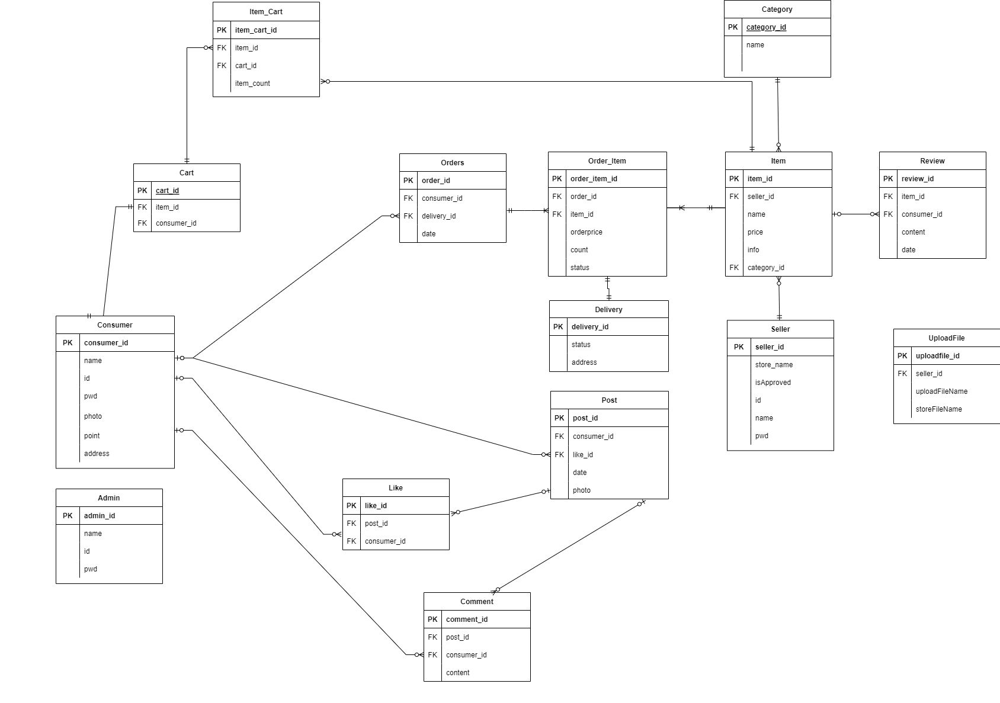
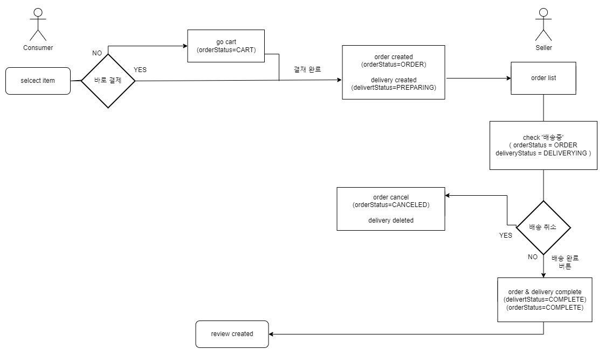
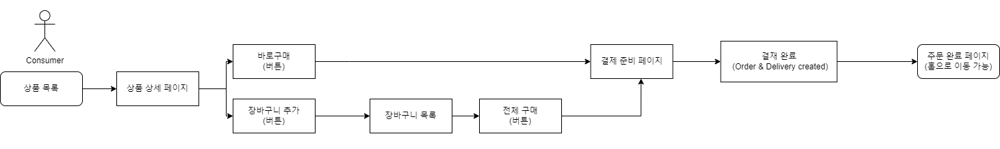
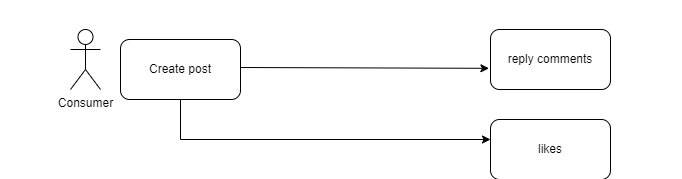

# 내일의 집(naeilHouse)

### 설명
오늘의 집(<a href="http://ohou.se" target="_blank">ohou.se</a>)을 차용한 쇼핑몰 만들기 

### 기간
2022.03.14 ~ 진행 중 

### 인원
3명 (백엔드 3명) 

 

### ERD

### Flowchart
- 주문 및 배송

- 결제

- 게시물 작성

### 개발 진행 및 개발 완료 사항
#### 개발 완료 부분

|Members|개발 부분|
|--------|----------------|
|구혜지| - 커뮤니티 글 생성   - 커뮤니티 글 좋아요/댓글 수 카운트   - 커뮤니티 글에 대한 댓글 생성   - 커뮤니티 글 좋아요 누르기   - 커뮤니티 댓글 삭제   - 회원 가입 시 장바구니 생성   - 상품 장바구니 담기   - 장바구니 조회   - 장바구니 상품 주문하기   - 배송 완료 Status 변경   - 커뮤니티 글 조회수 카운트  |
|박성준| - 완료사항작성   - 완료사항작성  |
|이채영| - 로그인(Session 이용)    - 주문취소   - 회원 관리 목록   - 관리자 관리 목록   - 판매자 관리 목록/판매자 승인, 판매자 비승인   - 커뮤니티 관리 목록   - 상품 관리 목록   - 주문 관리 목록   - 마이페이지   - 마이페이지/주문 내역   - 마이페이지/주문 내역에 대한 리뷰 생성   - 마이페이지/리뷰 내역   - 마이페이지/좋아요 내역   - 화면 레이아웃  |

#### 개발 진행 부분

|Members|개발 부분|
|--------|---------|
|구혜지| - 통합 검색 기능|
|박성준| - 진행사항작성   - 진행사항작성|
|이채영| - 진행사항작성  |

### API 명세서

#### 유저
|Function|URL|Method|Description|
|--------|---|------|-----------|
|[회원가입]|/join|POST|
|[회원 로그인]|/login|POST|소비자/ 판매자/ 관리자로 로그인|

 

#### 소비자
|Function|URL|Method|Description|
|--------|---|------|-----------------------|
|[상품 조회 리스트]|/list|GET|상품 목록 페이지 이동|
|[상품 상세]|/list/item/{id}|GET|상품 상세 페이지 이동|
|[장바구니]|/cart|GET|장바구니 페이지로 이동|
|[장바구니 상품 담기]|/item/{id}/cart|POST|상품 상세 페이지에서 장바구니 버튼을 눌러 물건 장바구니에 담기| 
|[장바구니 상품 구매]|/order|GET|결재|장바구니에 담긴 상품 주문 페이지로 이동| 
|[장바구니 상품 구매]|/order|POST|결재|장바구니에 담긴 상품 주문 하기| 
|[바로 구매]|/item/{id}/purchase|GET|상품 상세 페이지에서 바로 구매 버튼을 누르면 결제 준비 페이지로 이동|
|[결제하기]|/item/{id}/purchase|POST|결제 준비 페이지에서 결제하기 버튼을 누르면 결제 완료 후 결제 완료 페이지로 이동|
|[커뮤니티]|/community|GET|소비자가 작성하는 글 게시판 이동|
|[커뮤니티]|/community/{id}|GET|게시글 상세 페이지 이동|
|[커뮤니티]|/community/new|GET|새로운 글 작성 페이지 이동|
|[커뮤니티]|/community/write|GET|새로운 글 작성|
|[커뮤니티]|/community/{id}/likes|POST|좋아요 누르기|
|[커뮤니티]|/community/{id}/comments/write|POST|글에 댓글 달기|
|[커뮤니티]|/comments/{id}/put|PUT|글에 게시한 댓글 수정|
|[커뮤니티]|/comments/{id}/delete|DELETE|글에 게시한 댓글 삭제|
|[주문 취소]|/orderlist/{order_id}|GET|배송 완료가 되지 않은 주문 취소|
|[마이페이지]|/user/{consumer_id}|GET|소비자의 정보(좋아요, 프로필이미지, 주문, 리뷰, 좋아요)를 확인할 수 있는 마이페이지로 이동|
|[마이페이지/주문내역]|/user/orders|GET|소비자의 주문내역을 확인할 수 있는 페이지로 이동|
|[마이페이지/리뷰생성]|/user/orders/{orderitem_id}|POST|주문한 상품에 대해서 리뷰 생성|
|[마이페이지/리뷰내역]|/user/reviews|GET|소비자의 리뷰 내역을 확인할 수 있는 페이지로 이동|
|[마이페이지/좋아요내역]|/user/likes|GET|소비자의 좋아요 내역을 확인할 수 있는 페이지로 이동|
|[검색]|/search|GET|통합 검색|

#### 판매자
|Function|URL|Method|Description|
|--------|---|------|-----------------------|
|[판매자 상품 목록]|/seller/item/list|GET|판매자가 등록한 상품 목록 페이지로 이동|
|[상품 등록 폼]|/seller/item/add|GET|상품을 등록할 수 있는 페이지로 이동|
|[상품 등록]|/seller/item/add|POST|상품 등록 후 판매자 상품 목록 페이지로 이동|
|[상품 수정 폼]|/seller/item/edit|GET|상품을 수정할 수 있는 페이지로 이동|
|[상품 수정]|/seller/item/edit|POST|상품 수정 후 판매자 상품 목록 페이지로 이동|
|[상품 배송 완료]|/seller/deliveries/{id}/completed|PUT| 배송 완료|

#### 관리자
|Function|URL|Method|Description|
|--------|---|------|-----------------------|
|[소비자 관리 목록]|/admin/consumers|GET|소비자 정보를 관리할 수 있는 페이지로 이동|
|[판매자 관리 목록]|/admin/sellers|GET|판매자 정보를 관리할 수 있는 페이지로 이동|
|[판매자 관리 목록/판매자 승인]|/admin/sellers/{seller_id}/approved|GET|판매자를 승인 처리|
|[판매자 관리 목록/판매자 승인]|/admin/sellers/{seller_id}/notapproved|GET|판매자를 승인 철회|
|[커뮤니티 관리 목록]|/admin/posts|GET|커뮤니티 정보를 관리할 수 있는 페이지로 이동|
|[상품 관리 목록]|/admin/items|GET|상품 정보를 관리할 수 있는 페이지로 이동|
|[주문 관리 목록]|/admin/orders|GET|주문 정보를 관리할 수 있는 페이지로 이동|
