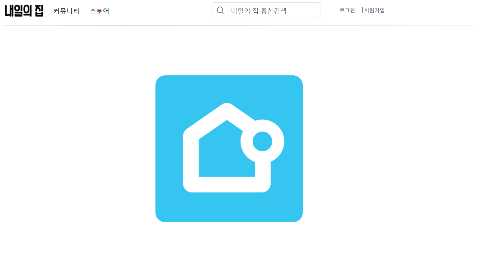
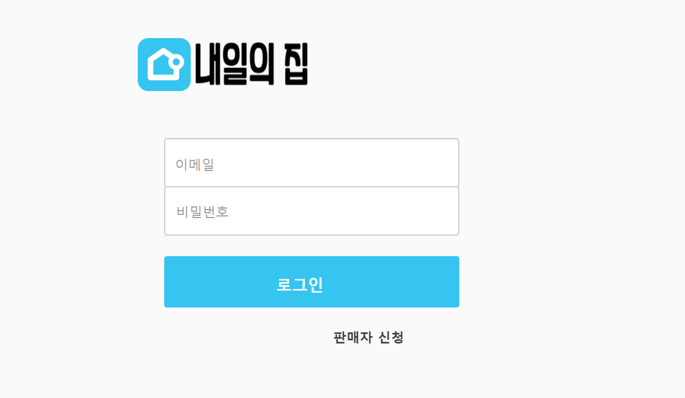
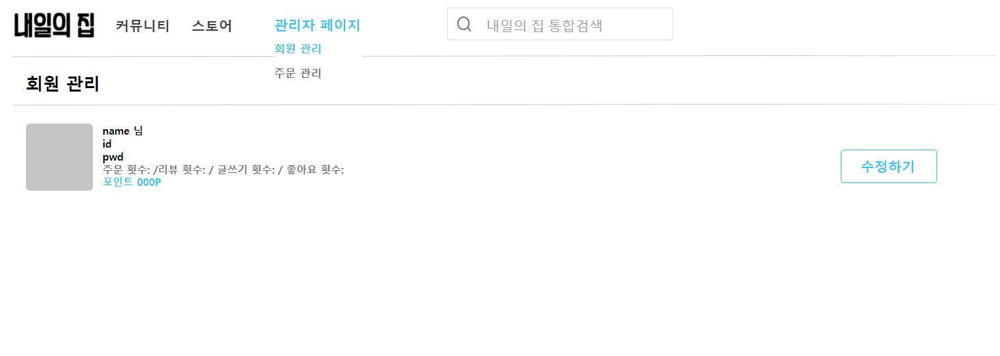
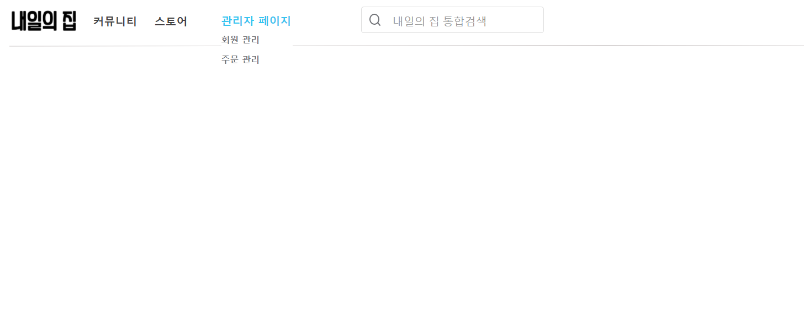

### 화면 설명

- main.html

    - u2: 회원가입 버튼
    - u5: 로그인 버튼
    - u8: 검색창 입력 부분
    - u12: 스토어 버튼
    - u13: 커뮤니티 버튼

- login.html

    - u27: 이메일 입력 받는 부분
    - u24: 비밀번호 입력 받는 부분
    - u21: 로그인 클릭 버튼
    - u28: 판매자 클릭 버튼
    
- admin_회원관리

- admin_default

    - u40: 스토어 버튼
    - u41: 커뮤니티 버튼
    - u39: '관리자 페이지'로 되어 있지만 마이페이지 혹은 판매자 페이지로 변경하셔서 사용하시면 될 것 같습니다!!

