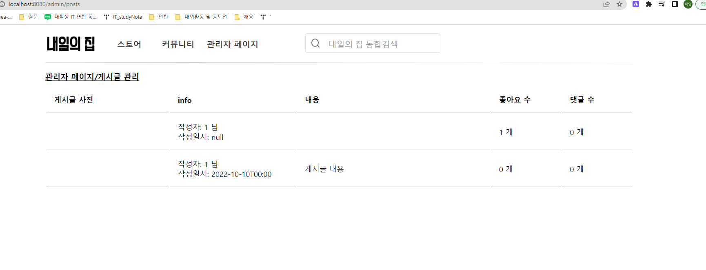

### 현재 진행 상태
- 추가 수정
    - size -> count repository query 피치 조인!!

    - 앞으로 진행할 것
        - 디자인
- 게시글 목록

    - 앞으로 해야할 것
        - 디자인
- 로그인

    - 앞으로 진행할 것
        - 입력하지 않았을 때 에러 나오는 방법 논의 후 추가
- 상품 목록
    - 앞으로 해야할 것
        - 디자인

- 주문 목록
    - 앞으로 해야할 것
        - 디자인

### 완료
- Admin home
    

- 소비자 목록
    

- 판매자 목록
    

### 회의 질문
- 댓글 목록, 리뷰 목록
- orderitem.count count가 자체 함수로 이름이 있어서 다른 것으로 변경!