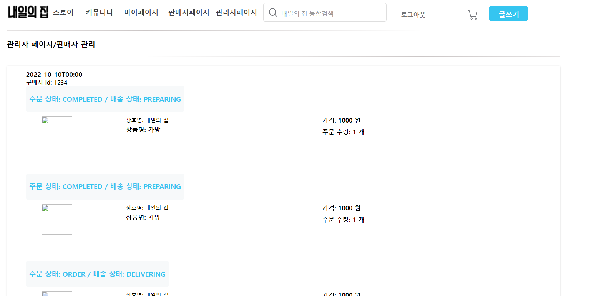

### 완료
- 로그아웃, 로그인
    
    
- Admin home
    

- 소비자 목록
    

- 판매자 목록
    

- 커뮤니티 목록
    

- 상품 목록
    

- 주문 목록
    

- 마이페이지
     

- 마이페이지/주문목록
     

- 마이페이지/리뷰목록
     

- 마이페이지/좋아요목록
     

### 회의 질문
- Review table만 가지고 어떤 주문인지 확인이 가능한가요?
<a th:href="@{/consumer/item/{id}/info (id=${item.id})}" class="btn btn-primary" role="button">상세 정보</a>