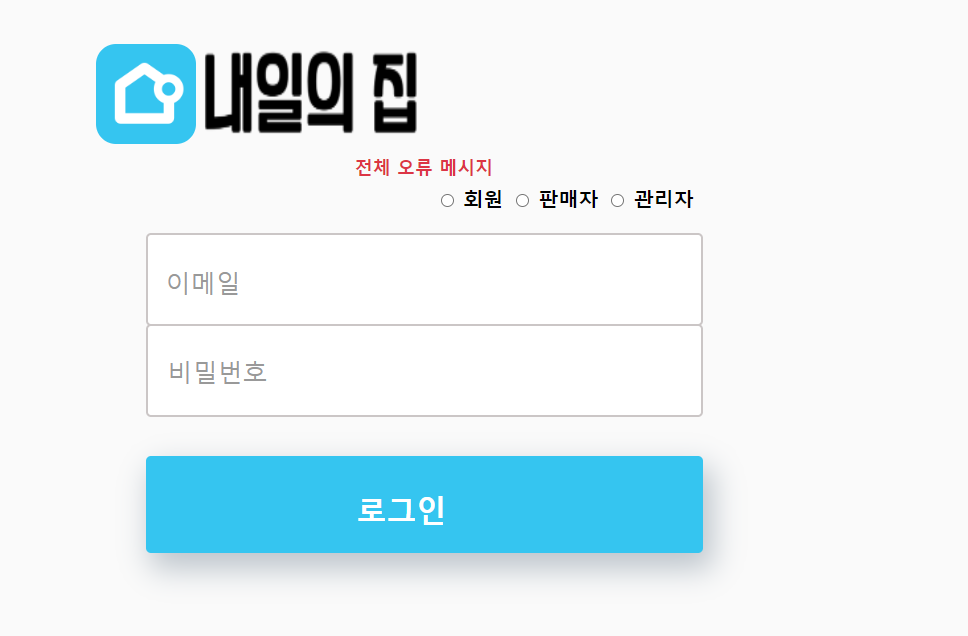
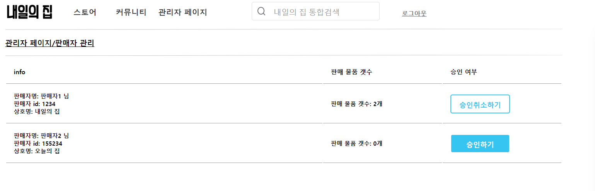
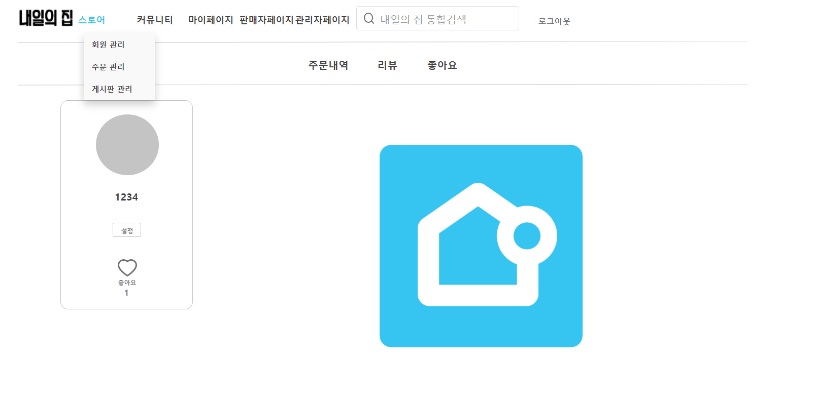

## 화면설명 
- 메인화면
    

- 로그인
    

- 소비자 목록
    

- 판매자 목록 : '승인하기', '승인취소하기' 버튼을 통해 해당 판매자의 승인 상태를 변경하는 것이 가능
    

- 커뮤니티 목록
    

- 상품 목록
    

- 주문 목록
    

- 마이페이지
     

- 마이페이지/주문목록: 주문에 내역에 대해서 '리뷰하기'버튼을 누르면 리뷰 작성을 위한 모달이 띄워짐.
     

- 마이페이지/리뷰쓰기: 리뷰작성 후 '완료' 버튼을 누르면 리뷰가 생성된다.
     
     
- 마이페이지/리뷰목록
     

- 마이페이지/좋아요목록
     